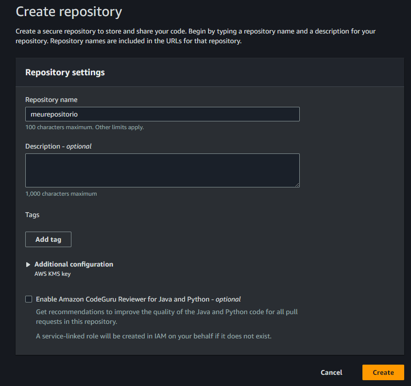
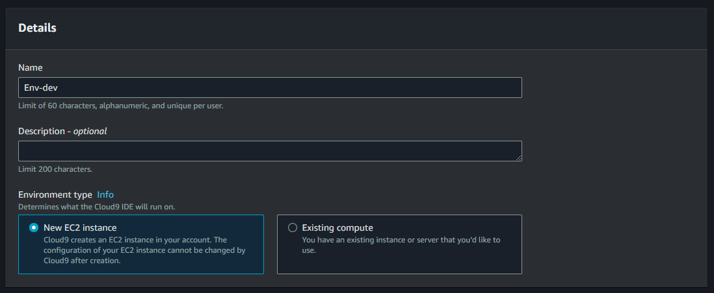
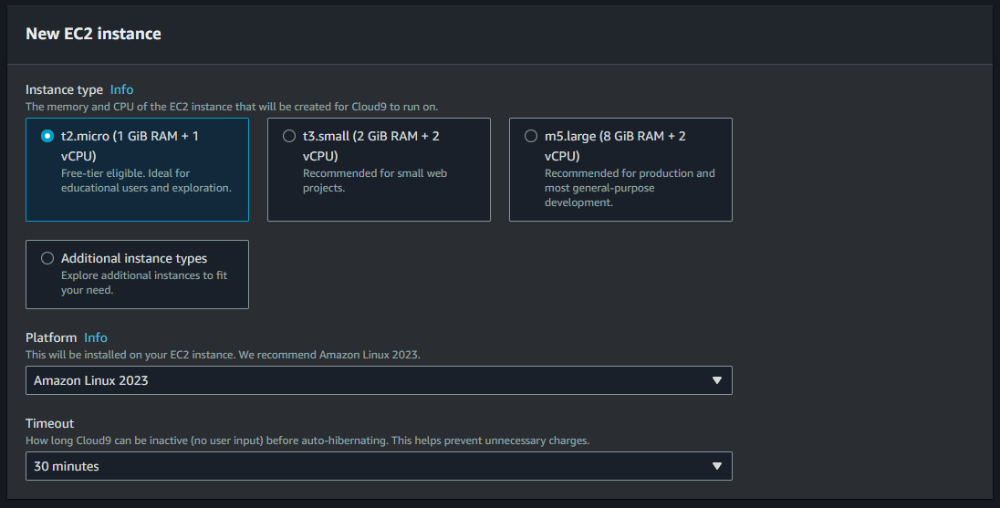
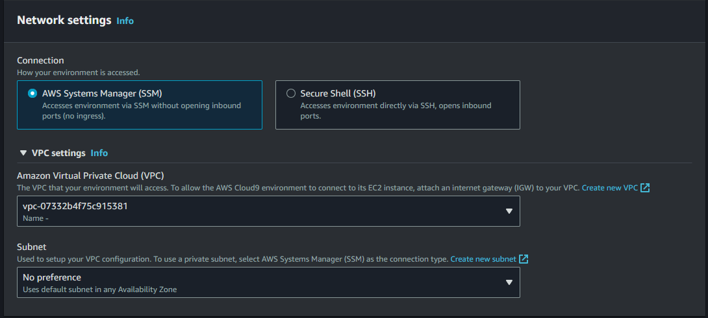
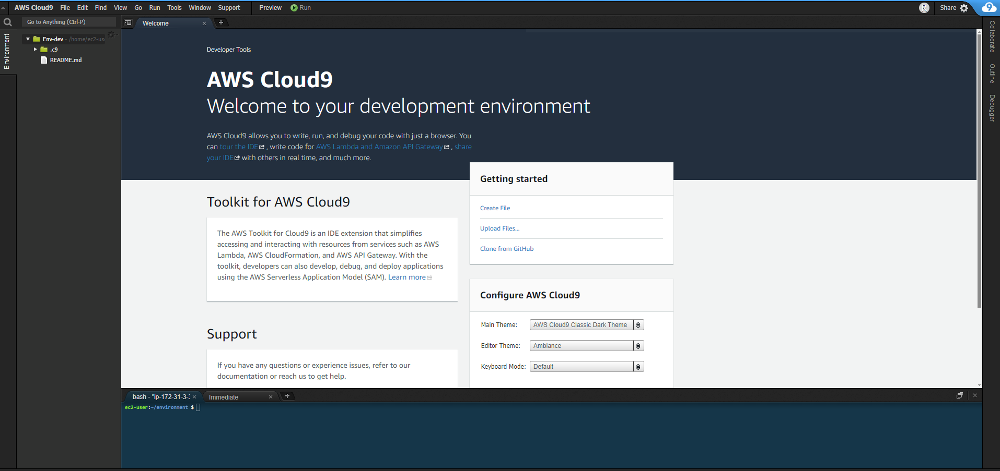
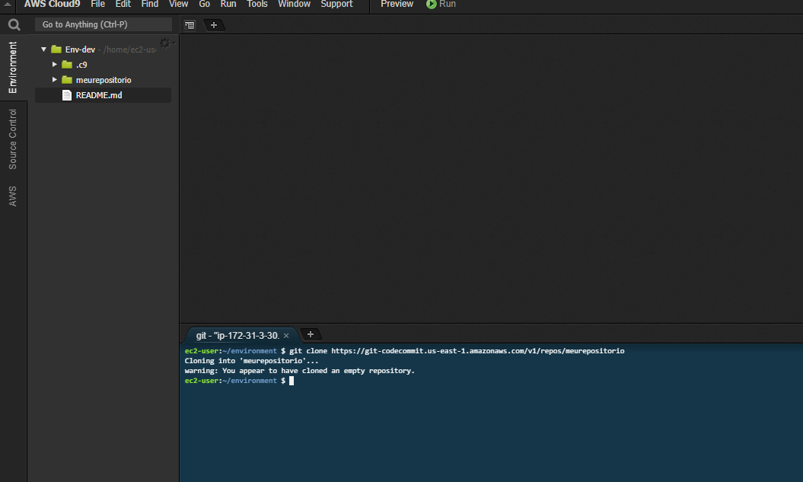
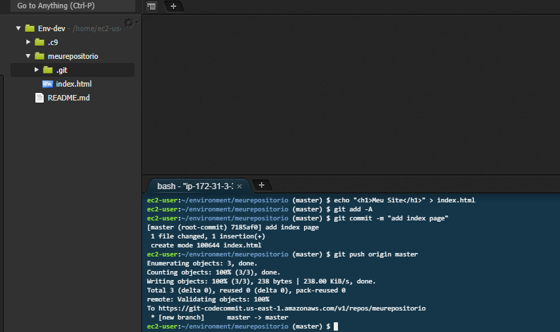
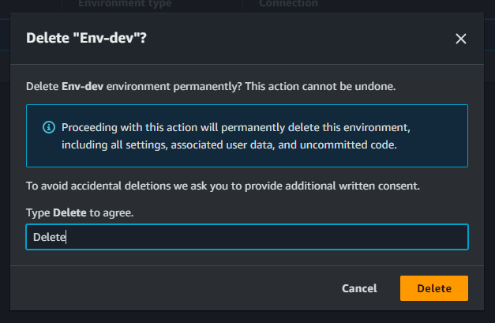

Olá, espero que esteja bem ! 

No post de hoje vou ensinar como configurar o Code Commit + Cloud9 na AWS, para que você possa ter um ambiente minimo de desenvolvimento na AWS totalmente gerenciado e o que é melhor sem nada de configuração em sua maquina local, pois tudo estará sendo executado e salvo na AWS.

# Pré-requisitos

- Conta na AWS
- Acesso ao console da AWS
- Conhecimento básico em Git


# Ferramentas:

### Code Commit

O Code Commit é um serviço da AWS que permite hospedar respositórios Git, ele é como um Github,Gitlab, Bitbucket. O ponto interessante é que é totalmente gerenciado pela AWS e você não precisa se preocupar com nada.

### Cloud9

O Cloud9 é um IDE online da AWS, ele é totalmente gerenciado pela AWS você só precisa de navegador para poder acessar o serviço e começar a escrever e executar seus códigos.

# Custos

Sim, há custos para utilizar o Code Commit e Cloud9, para esse teste o valor gasto aqui será quase zero, portanto pode ficar tranquilo quanto a isso, e não se esqueça excluir os recursos ao final do teste, caso queira dar uma olhada precificação dos serviços acesse os links abaixo:

- [Code Commit](https://aws.amazon.com/pt/codecommit/pricing/)

- [Cloud9](https://aws.amazon.com/pt/cloud9/pricing/)

# Começando

Para entender melhor como vai funcionar, primeriamente vamos configurar o Code Commit isso envolve criar um repositório e cofigurar as credenciais de acesso. Estou prossupondo que você já tenha uma conta na AWS e esteja logado no console da AWS. No segundo passo vamos configurar o Cloud9 para que possamos clonar o repositório criado no Code Commit e começar a escrever e executar códigos.

# Criando um resitório no Code Commit

1 - Na console da AWS no canto superior esquerdo na barra de busca digite Code Commit, então clique sobre o serviço


2 - Na pagina inicial do Code Commit será listado todos os repositórios que possuímos, como não temos nenhum clique no botão
criar um novo repositório.


3 - Na pagina de criação do repositório, de um nome se sua preferência ao seu repositório, há outras opções podemos deixar como padrão.



4 - Seu repositório foi criádo com sucesso, agora de uma olhada no menu lateral para conferir os recursos, por hora como você pode ver na aba **code**
que nosso repositório está vazio então vamos pular para configuração do Cloud9 e depois voltamos para configurar a conexão e fazer nosso primeiro commit.


# Configurando o Cloud9

1 - Na barra de pesquisa digite Cloud9 e clique sobre o serviço


2 - Na pagina do Cloud9 será listados todos os ambiente que possúimos, no seu caso não haverá nenhum, então clique no botão criar novo ambiente.


3.1 - Para a criação do Cloud9 temos que passar por algumas etapas, aprimera e preencher o nome e em **Environment type** deixe como padrão, quando você cria um ambiente no Cloud9 ele na verdade é configurado para ser executado em cima de uma instância ec2, tanto é que após você criar o seu ambiente você pode ir no serviço de ec2 ele será listado lá.



3.2 - Na seção **New EC2 instance** você pode estar configurando as especificações de seu ambiente como memório ram, vcpu e plataforma. Fique a vontade para visualizar e testar, mas se lembre isso deve gerar um custo dependendo da configuração. No nosso caso ficamos que com a padrão que está dentro do Free-tier e que servira para nosso proposito de apenas testar o recurso.



3.2 - Na seção **Network** deixe tudo como padrão, vamo usar o SSM para se conectar em nosso ambiente e em VPC vamo usar a padrão que já vem em
nossa conta na AWS. Mas caso tenha um conhecimento mais aprofundado VPC/SUBNETS você pode estar alterando para uma de sua preferência.



3.3 - Caso queira adicone tags a este recurso e então crie o ambiente do cloud9, este passo pode demorar um pouquinho.


3.4 - Com seu ambiente criádo, selecione seu ambiente e clique no botão **open** para abrir seu ambiente em uma nova aba do navegador.


3.5 - Parabéns, estamos com nosso Cloud9 sendo executado, fique a vontade para dar uma olharda no recursos da IDE, lebramdo que ela vem com alguns coisas já instalada como docker e git. Agora vamos voltar para a configuração de nosso Code Commit



# Configurando Code Commit + Cloud9

1 - Primeiro vamos configurar um usuário e email em nosso git, para isso digite os comando abaixo no terminal do Cloud9 e altere para usar suas informações de usuário
````
git config --global user.name "Danilo Santos"
git config --global user.email danilocarsan@gmail.com
````

2 - Seguindo a documentação de apoio da aws, execute esses comando abaixo para configurar as credências se acesso

**Documentação:** [setting-up-ide-c9](https://docs.aws.amazon.com/pt_br/codecommit/latest/userguide/setting-up-ide-c9.html)
````
git config --global credential.helper '!aws codecommit credential-helper $@'
git config --global credential.UseHttpPath true
````

3 - Agora vamos fazer o clone de nosso repositório, para isso vá até Code Commit selecione seu repositório e depois na aba **code** no canto superior
direito clique em clone HTTPS.


4 - Volte para seu terminal do Cloud9 e então de comando git clone mais a url copiada no passo anterior

````
git clone https://git-codecommit.us-east-1.amazonaws.com/v1/repos/meurepositorio
````

5 - Parabéns nosso repositório foi clona com sucesso



5 - Na pasta do repositório crei alguns arquivos e depois faça commit push
````
echo "<h1>Meu Site</h1>" > index.html
git add -A
git commit -m "add index page"
git push origin master
````

Parabéns mais uma vez, como pode ver nossas alterações foram sincronizadas com nosso repositório no Code Commit, acessando nosso repositório
no Code Commit vemos nossos arquivos que criamos e na aba Commits vemos o histótico de Commit e que o realizou.




# Excluindo os recursos

Como sempre não se esqueça de excluir os recursos para não ter dor de cabeça

1 - Para excluir o Cloud9 vá até a lista de ambientes, selecione o ambiente desejado e então clique em excluir no canto superior direito, digite exluir para confimar e clique em delete.




2 - Para excluir o seu repositório navegue até o serviço Code Commit e na lista de repositórios selecione o repositório desejado e então no canto superior direito clique em excluir repositório. Digite delete para configar e exclua seu repositório.


# Conclusão

Bem é isso, espero que tenha gostado do post, talvez em um proximo post traga um continuação utilizando Larave + Sail + Cloud9. Se tiver alguma dúvida ou sugestão de post, por favor deixe nos comentários. Até a próxima.

# Referências

- [Documentação AWS Code Commit](https://docs.aws.amazon.com/pt_br/codecommit/latest/userguide/welcome.html)
- [Documentação AWS Cloud9](https://docs.aws.amazon.com/pt_br/cloud9/latest/user-guide/welcome.html)
- [Integrar o AWS Cloud9 ao AWS CodeCommit](https://docs.aws.amazon.com/pt_br/codecommit/latest/userguide/setting-up-ide-c9.html)